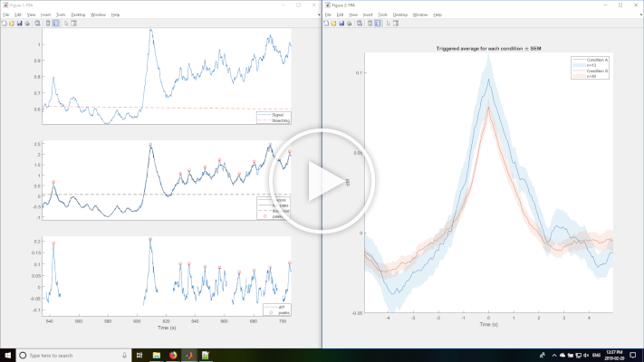

# Fiber-photometry analysis
MATLAB scripts to plot data from a fiber-photometry recording.

## Prerequisites
* [MATLAB][MATLAB] (last tested with R2019a)

## Installation
* Install MATLAB.
* Install Curve Fitting Toolbox.
* Download and extract these scripts to Documents/MATLAB folder.

Also, if your data was recorded with TDT DAQ:
* Download TDT MATLAB SDK from https://www.tdt.com/support/matlab-sdk/
* Extract `TDTMatlabSDK.zip` and move folder to Documents/MATLAB folder
* Open MATLAB, execute the following command:
```MATLAB
  addpath(genpath([getenv('USERPROFILE'), '/Documents/MATLAB/TDTMatlabSDK/TDTSDK']));;
```

## Usage
See examples/description/video below and/or edit `FPAexamples.m` according to your data recordings.

```matlab
FPA(time, signal, reference, configuration)
```
Plot spontaneous activity from a fiber-photometry experiment. Data is processed according to the `configuration`.

[](https://drive.google.com/file/d/1OXrwykbzTlqiQ13bCYg5v_xJNJIpqeb0)

## Analysis
Load vectors time, signal (e.g. 465nm), and reference (e.g. 405nm) using a loader compatible with your data. Define parameters in the configuration and run FPA. Internally, FPA will:
- Load and resample data.
- Low-pass filter an artifact-free portion of the data and fit an exponential decay to correct for photo-bleaching.
- Correct for movement artifacts with reference signal.
- Compute z-score and low-pass filter to detect peaks.
- Compute df/f in a moving time window to normalize traces around peaks.
- Compute triggered averages of spontaneous activity grouped by condition/epochs definition.

## Configuration
`configuration` is a struct with the following fields (defaults are used for missing fields):
- `resamplingFrequency` - Resampling frequency (Hz).
- `artifactEpochs` - Time epochs (s) to include to exclude; data here will be interpolated.
- `zScoreEpochs` - Time epochs (s) to include for z-score normalization.
- `bleachingCorrectionEpochs` - Time epochs (s) to include for bleaching correction.
- `f0Function` - One of `@movmean`, `@movmedian`, `@movmin`.
- `f0Window` - Length of the moving window to calculate f0.
- `f1Function` - One of `@movmean`, `@movmedian`, `@movmin`, `@movstd`.
- `f1Window` - Length of the moving window to calculate f1.
- `peaksLowpassFrequency` - Frequency of lowpass filter to detect peaks.
- `thresholdingFunction` - One of `@mad`, `@std`.
- `thresholdFactor` - Thresholding cut-off.
- `conditionEpochs` - Epochs that involve different conditions: `{'epoch1', [start1, end1, start2, end2, ...], 'epoch2', ...}`
- `triggeredWindow` - Length of the time window around each peak.

See source code for default values:
```matlab
edit('FPA');
```

Units for time and frequency are seconds and hertz respectively.

## Normalization recipes

`df/f` is calculated as `(f - f0) / f1`, where `f0` and `f1` change according to the configuration.

For example, you may want to see changes relative to a 10s moving window:
```matlab
configuration.f0Function = @movmean;
configuration.f1Function = @movmean;
configuration.f0Window = 10;
configuration.f1Window = 10;
```

... or you may want to see changes from the standard deviation of the whole recording:
```matlab
configuration.f0Function = @movmean;
configuration.f1Function = @movstd;
configuration.f0Window = Inf;
configuration.f1Window = Inf;
```

## Examples

### Example 1 - Analyze fiber-photometry data recorded with Doric DAQ
```
inputDataFile = 'data/Doric photometry data.csv';
signalTitle = 'AIn-1 - Demodulated(Lock-In)';
referenceTitle = 'AIn-2 - Demodulated(Lock-In)';
configuration.resamplingFrequency = 20;
configuration.bleachingCorrectionEpochs = [-Inf, 600, 960, Inf];
configuration.zScoreEpochs = [-Inf, 600];
configuration.conditionEpochs = {'Pre', [100, 220], 'During 1', [650, 890], 'Post', [1480, 1600]};
configuration.triggeredWindow = 10;
configuration.f0Function = @movmean;
configuration.f0Window = 10;
configuration.f1Function = @movmean;
configuration.f1Window = 10;
configuration.peaksLowpassFrequency = 0.2;
configuration.thresholdingFunction = @mad;
configuration.thresholdFactor = 0.10;
[data, names] = loadData(inputDataFile);
s = ismember(names, signalTitle);
r = ismember(names, referenceTitle);
time = data(:, 1);
signal = data(:, s);
reference = data(:, r);
FPA(time, signal, reference, configuration);
```

### Example 2 - Analyze fiber-photometry data recorded with Doric DAQ and behavioral data recorded with CleverSys
```
% Fiber-photometry recording file.
inputDataFile = 'data/Doric photometry data.csv';
% CleverSys event file in seconds and the name of the target sheet within.
inputEventFile = {'data/CleverSys event data.xlsx', 'Trial 1'};
% Names of columns corresponding to 465nm and 405nm.
signalTitle = 'AIn-1 - Demodulated(Lock-In)';
referenceTitle = 'AIn-2 - Demodulated(Lock-In)';
% Other settings.
configuration.resamplingFrequency = 20;
configuration.bleachingCorrectionEpochs = [-Inf, 600, 960, Inf];
configuration.artifactEpochs = [603, 620, 910, 915];
configuration.zScoreEpochs = [-Inf, 600];
configuration.triggeredWindow = 10;
configuration.f0Function = @movmean;
configuration.f0Window = 10;
configuration.f1Function = @movmean;
configuration.f1Window = 10;
configuration.peaksLowpassFrequency = 0.2;
configuration.thresholdingFunction = @mad;
configuration.thresholdFactor = 2;
% Extract epochs from CleverSys output.
events = loadCleverSysEvents(inputEventFile{:});
eventNames = events.keys;
configuration.conditionEpochs = cellfun(@(eventName) {eventName, reshape([events(eventName).start, events(eventName).start + events(eventName).duration]', 1, 2 * numel(events(eventName).start))}, eventNames, 'UniformOutput', false);
configuration.conditionEpochs = cat(2, configuration.conditionEpochs{:});
[data, names] = loadData(inputDataFile);
s = ismember(names, signalTitle);
r = ismember(names, referenceTitle);
time = data(:, 1);
signal = data(:, s);
reference = data(:, r);
results = FPA(time, signal, reference, configuration);
% Save peak times to file.
[folder, basename] = fileparts(inputDataFile);
output = fullfile(folder, sprintf('%s peak-time.csv', basename));
fid = fopen(output, 'w');
fprintf(fid, 'Peak Time (s)\n');
fprintf(fid, '%.3f\n', time(results.peaksId));
fclose(fid);
```

### Example 3 - Analyze fiber-photometry data recorded with TDT DAQ
```
inputFolder = 'data/MM_Pilot1-190702-132554';
signalTitle = 'Dv1A';
referenceTitle = 'Dv2A';
configuration.resamplingFrequency = 20;
configuration.bleachingCorrectionEpochs = [1, 1748];
configuration.zScoreEpochs = [-Inf, Inf];
configuration.conditionEpochs = {'Baseline', [1, 900], 'Test', [1102, 1702]};
configuration.triggeredWindow = 10;
configuration.f0Function = @movmean;
configuration.f0Window = 10;
configuration.f1Function = @movmean;
configuration.f1Window = 10;
configuration.peaksLowpassFrequency = 0.2;
configuration.thresholdingFunction = @mad;
configuration.thresholdFactor = 0.10;
[data, names] = loadTDT(inputFolder);
s = ismember(names, signalTitle);
r = ismember(names, referenceTitle);
time = data(:, 1);
signal = data(:, s);
reference = data(:, r);
FPA(time, signal, reference, configuration);
```

## Data loaders
### Load a CSV file (e.g. data acquired with Doric or Inscopix DAQ)
```MATLAB
[data, names] = loadData(filename)
```

Returns a `data` matrix where columns correspond to channels listed in `names`, that is, time followed by other data columns.

Expected format #1:

| time | name 1 | name 2 | ... | name N |
|:----:|:-----: |:------:|:---:|:------:|
|  t1  |   a1   |   b2   | ... |   zN   |
|  ... |   ...  |  ....  | ... |   ...  |
|  tM  |   aM   |   bM   | ... |   zM   |

Expected format #2:

|      | name 1 | name 2 | ... | name N |
|:----:|:-----: |:------:|:---:|:------:|
| time | accepted\|rejected | accepted\|rejected | ... | accepted\|rejected |
|  t1  |   a1   |   b2   | ... |   zN   |
|  ... |   ...  |  ....  | ... |   ...  |
|  tM  |   aM   |   bM   | ... |   zM   |

### Load an XLS or XLSX file (e.g. data acquired with Doric or Inscopix DAQ)
```MATLAB
[data, names, sheetName] = loadData(filename, <sheetNumber|sheetName>)
```

Returns a `data` matrix where columns correspond to channels listed in `names`. A sheet number or a sheet name can be passed as the second parameter (default is the first sheet in the document). The sheet name is also returned.

Expected format for each sheed in a document:

| time | name 1 | name 2 | ... | name N |
|:----:|:-----: |:------:|:---:|:------:|
|  t1  |   a1   |   b2   | ... |   zN   |
|  ... |   ...  |  ....  | ... |   ...  |
|  tM  |   aM   |   bM   | ... |   zM   |

### Load a data folder acquired with TDT DAQ
```MATLAB
[data, names] = loadTDT(folder)
```

Parses a project folder stored by a TDT DAQ and returns a `data` matrix where columns correspond to channels listed in `names`.

### Load TTL logged by a Doric DAQ
```MATLAB
ttl = loadDoricTTL(filename)
```

Returns timestamps where pin `IO1` changes from low to high state in a Doric DAQ.

### Load behavioral events detected by CleverSys
```MATLAB
events = loadCleverSysEvents(filename, sheet)
```

Returns a map of events generated by CleverSys.

## Version History
* 0.1.1: Library and example code. Added loaders for multiple data acquisition systems.
* 0.1.0: Initial release.

## License
© 2019 [Leonardo Molina][Leonardo Molina]

This project is licensed under the [GNU GPLv3 License][LICENSE.md].

[Leonardo Molina]: https://github.com/leomol
[MATLAB]: https://www.mathworks.com/downloads/
[LICENSE.md]: LICENSE.md